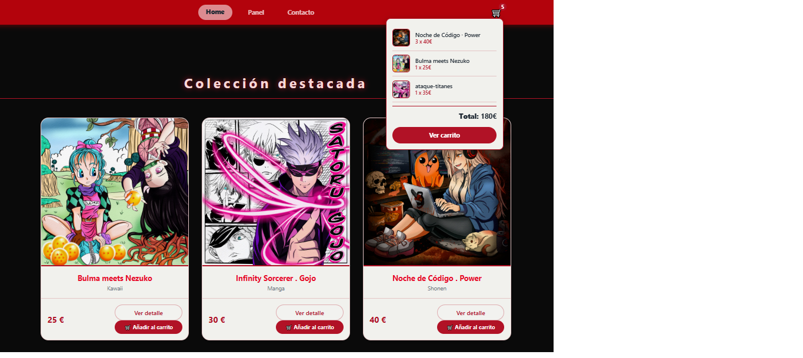
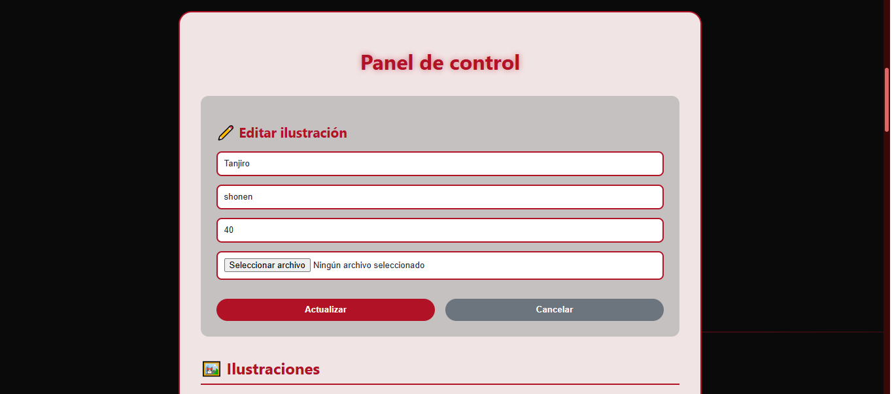
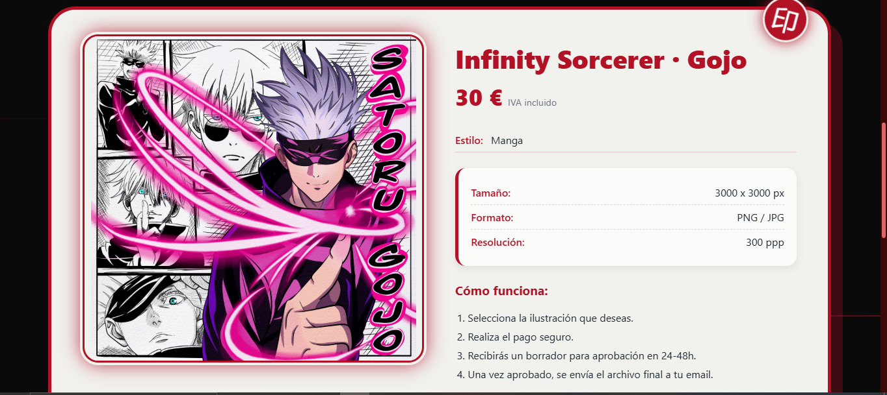
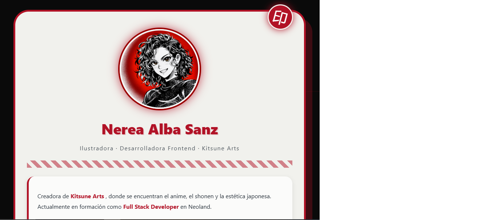
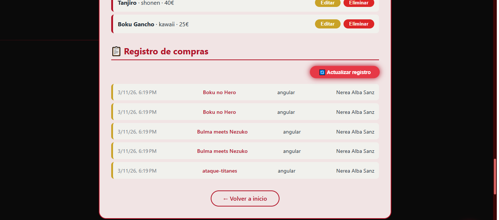
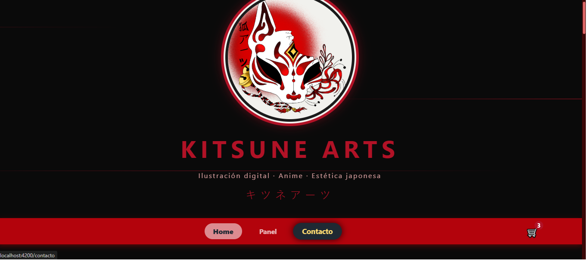
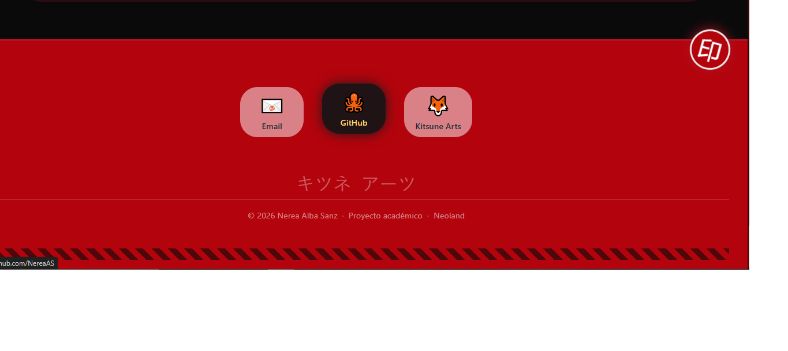

# 🦊 Kitsune Arts – Frontend (Angular) 

**Kitsune Arts** es una web de ilustraciones digitales de estética japonesa, desarrollada con **Angular** como parte del proyecto final del bootcamp Full Stack de Neoland.

📁 **Repositorio completo**: [https://github.com/NereaAS/proyecto5-final](https://github.com/NereaAS/proyecto5-final) 

--- 

## 🚀 Tecnologías utilizadas 

- ⚛️ Angular (standalone components) 
- 🧭 Angular Router 
- 🎨 CSS puro con diseño personalizado 
- 🌐 Fetch API (HttpClient) 
- 🗂️ Backend: Node.js + Express 
- 🛒 Carrito persistente con `localStorage`

---

## 🎨 Branding y diseño (100% original) 
  
- 🦊 **Logo y avatar diseñados a mano en Procreate** por la autora. 
- 🖼️ **Todas las ilustraciones de la web** (Bulma x Nezuko, Power, One Piece, Akaza, Pokémon, etc.) están **creadas originalmente por Nerea Alba Sanz**. 
- 🎨 Paleta de colores inspirada en la estética japonesa: rojos, negros y detalles dorados. 
- 🖌️ Efectos de neón y líneas animadas que recuerdan a la cultura visual de Japón.

 --- 
 
 ## 📂 Estructura del proyecto

frontend-angular/
├── src/
│   ├── app/
│   │   ├── pages/
│   │   │   ├── home/               # Página de inicio con galería
│   │   │   ├── dashboard/           # Panel de control (CRUD)
│   │   │   ├── detalle-producto/     # Vista de detalle de ilustración
│   │   │   ├── contacto/             # Página de contacto
│   │   │   └── carrito/               # Carrito de compras
│   │   ├── services/
│   │   │   └── cart.service.ts       # Servicio del carrito
│   │   ├── app.routes.ts
│   │   ├── app.html
│   │   └── app.ts
│   ├── assets/
│   │   └── screenshots/               # Capturas para el README
│   └── index.html
├── angular.json
└── package.json

```

---

## 🧭 Rutas principales

| Ruta | Funcionalidad |
|------|---------------|
| `/` o `/home` | Página de inicio con colecciones destacadas |
| `/panel` | Panel de control (CRUD de ilustraciones) |
| `/producto/:id` | Detalle de una ilustración |
| `/contacto` | Información profesional de la desarrolladora |
| `/carrito` | Carrito de compras persistente |

---

## ✨ Funcionalidades

- 🖼️ **Galería por colecciones**: Kawaii, Shonen y Manga, todas con ilustraciones originales.
- 🔍 **Vista de detalle** de cada ilustración (tamaño, formato, precio, proceso de compra).
- 🛒 **Carrito persistente** con `localStorage` y contador en navbar.
- 🧑‍💻 **Panel de administración (CRUD)**:
  - Crear nuevas ilustraciones
  - Editar ilustraciones existentes
  - Eliminar ilustraciones
- 🔄 **Registro de compras** simulado mediante backend Express.
- 📱 **Diseño responsive** adaptado a móvil y tablet.

---

## ⚠️ Problemas conocidos y soluciones aplicadas

Durante el desarrollo surgieron varios problemas técnicos, que se resolvieron de la siguiente manera:

### 🔴 **Panel de control (CRUD)**
- **Problema:** El panel no cargaba los datos al entrar desde Home, solo funcionaba al hacer doble clic en el enlace.
- **Solución:** Se aplicó una estrategia de recarga forzada en el componente mediante `routeReuseStrategy` y un pequeño retardo con `setTimeout` para asegurar la carga de datos.

### 🔴 **Página de detalle de producto**
- **Problema:** Los datos del producto no se renderizaban correctamente al navegar desde Home, debido a problemas de detección de cambios en Angular.
- **Solución:** Se optó por cargar los datos de forma estática (quemados) en el componente, lo que garantiza que la vista se muestre correctamente y el carrito funcione sin errores.

### 🔴 **Imágenes y rutas**
- **Problema:** Las imágenes no se veían por incoherencias entre los nombres de archivo y las rutas en el backend.
- **Solución:** Se unificaron los nombres y se creó una función `rutaImagen()` que construye la URL correcta dinámicamente.

---

## 🖼️ Capturas de pantalla

| Inicio | Panel |
|--------|-------|
|  |  |

| Detalle | Contacto |
|---------|----------|
|  |  |

| Carrito | Registro de compras |
|---------|---------------------|
|  |  |

| Header | Footer |
|--------|--------|
|  |  |

---

## 🔧 Instalación y ejecución

### Requisitos previos
- Node.js instalado
- Backend Express ejecutándose

### 1️⃣ Clonar el repositorio
```bash
git clone https://github.com/NereaAS/proyecto5-final.git
cd proyecto5-final
```

2️⃣ Arrancar el backend

```bash
cd backend-express
node server.js
```

El backend estará disponible en http://localhost:3001

3️⃣ Arrancar el frontend Angular

```bash
cd frontend-angular
npm install
ng serve
```

La aplicación se abrirá en http://localhost:4200

---

🔗 Endpoints del backend

Endpoint Método Descripción
/api/proyecto5/angular GET Obtener todas las ilustraciones
/api/proyecto5/angular POST Crear nueva ilustración
/api/proyecto5/angular/:id PUT Actualizar ilustración
/api/proyecto5/angular/:id DELETE Eliminar ilustración
/api/proyecto5/ventas POST Registrar una compra
/api/proyecto5/ventas GET Obtener historial de compras

⚠️ Es necesario tener el backend levantado para que el panel CRUD funcione correctamente.

---

🧠 Decisiones de diseño

· Estilo japonés: Neones rojos, sellos decorativos, tipografías inspiradas en la cultura nipona.
· Separación visual: La página de contacto no tiene navbar ni footer para destacar como elemento creativo.
· Coherencia visual: Mismos estilos de cards, botones y colores en todas las páginas.
· Usabilidad: Grids de 3 columnas en colecciones para facilitar la navegación.
· Carrito persistente: Implementado con localStorage para mantener los productos aunque se recargue la página.

---

📌 Estado del proyecto

✔️ Página de inicio con colecciones
✔️ Vista de detalle de ilustración
✔️ Panel de control CRUD
✔️ Registro de compras
✔️ Carrito persistente
✔️ Conexión con backend
✔️ Estilos personalizados
✔️ Logo y avatar originales creados en Procreate
✔️ Todas las ilustraciones de la web son obra de la autora

🔜 Posibles mejoras futuras:

· Página de exploración con filtros
· Autenticación de usuarios
· Mejora en la recarga del panel

---

👩‍💻 Autora

Nerea Alba Sanz
📧 nerea_7789@hotmail.com
🐙 github.com/NereaAS

📍 Madrid, España
🎓 Proyecto académico – Bootcamp Full Stack Developer · Neoland
📅 2026

```

---

