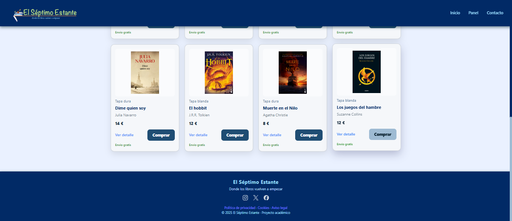
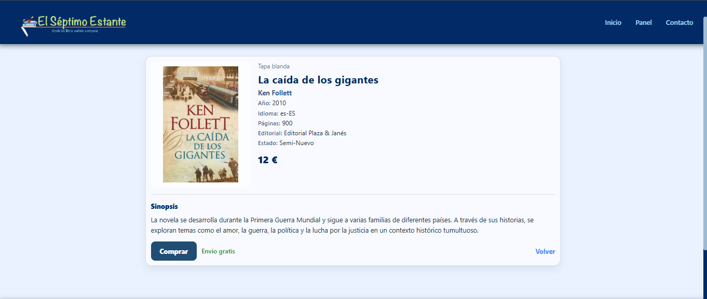
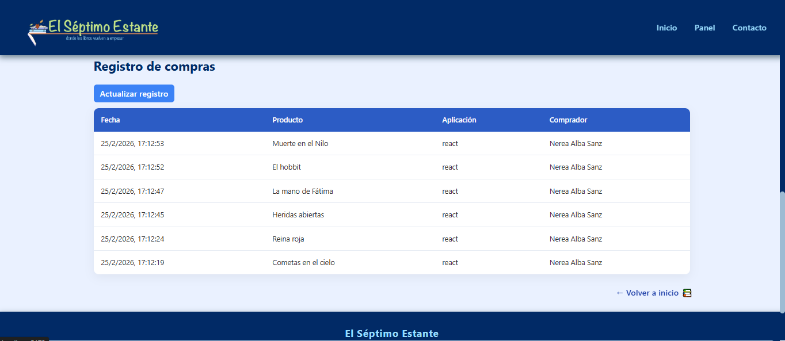
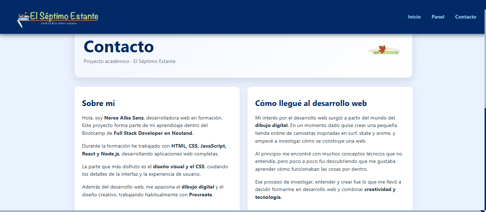
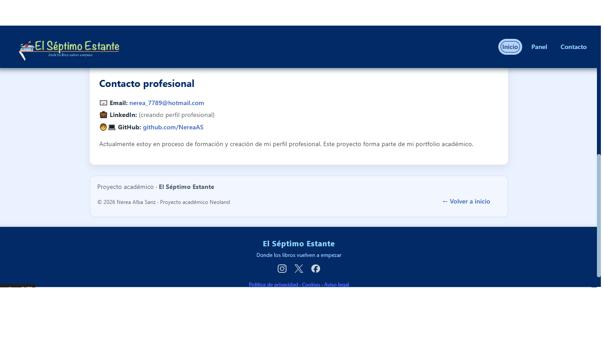

# 📚 El Séptimo Estante – Frontend (React)

Proyecto frontend desarrollado con **React** como parte del proyecto final del bootcamp Full Stack.  
“El Séptimo Estante” es una web de compraventa de libros de segunda mano, donde los usuarios pueden navegar por un catálogo, ver el detalle de cada libro y realizar compras simuladas. Incluye también un **panel de administración (CRUD)** para la gestión de productos.

📁 **Repositorio completo**: [https://github.com/NereaAS/proyecto5-final](https://github.com/NereaAS/proyecto5-final)

---

## 🚀 Tecnologías utilizadas

- ⚛️ React + Vite  
- 🧭 React Router DOM  
- 🎨 CSS puro (custom UI)  
- 🌐 Fetch API  
- 🗂️ Backend: Node.js + Express  

---

## 🎨 Branding y diseño

- 🦊 **Logo y favicon diseñados a mano en Procreate**  
- 🎨 Diseño UI personalizado con CSS  
- 🖌️ Estética cuidada inspirada en tiendas de libros online  

---

## 📂 Estructura del proyecto (frontend-react)

```bash

frontend-react/
├── public/
├── src/
│   ├── assets/
│   │   └── screenshots/     (capturas de pantalla)
│   ├── components/
│   │   └── libro.jsx
│   ├── pages/
│   │   ├── Contacto.jsx
│   │   ├── DetalleProducto.jsx
│   │   ├── Inicio.jsx
│   │   └── Panel.jsx
│   ├── App.css
│   ├── App.jsx
│   ├── index.css
│   └── main.jsx
├── .gitignore
├── eslint.config.js
├── index.html
├── package-lock.json
├── package.json
├── README.md
└── vite.config.js

```

---

## 🧭 Rutas principales

- `/` → Inicio (catálogo de libros)
- `/productos/:id` → Detalle del libro
- `/panel` → Panel de administración (CRUD)
- `/contacto` → Página de contacto

---

## ✨ Funcionalidades

- 📖 Catálogo de libros en formato grid  
- 🔍 Vista de detalle de cada libro  
- 🛒 Registro de compras  
- 🧑‍💻 Panel de administración:  
  - Crear libros  
  - Editar libros  
  - Eliminar libros  
- 🔄 Conexión con API backend  
- 📱 Diseño responsive  

---

## 🔧 Instalación y ejecución

### Requisitos previos

- Node.js instalado
- Backend Express ejecutándose

### 1️⃣ Clonar el repositorio

```bash
git clone https://github.com/NereaAS/proyecto5-final.git
cd proyecto5-final
```

2️⃣ Arrancar el backend

```bash
cd backend-express
node server.js
```

El backend estará disponible en <http://localhost:3001>

3️⃣ Arrancar el frontend React (en otra terminal)

```bash
cd frontend-react
npm install
npm run dev
```

La aplicación se abrirá en <http://localhost:5173>

---

🔗 Endpoints del backend

```bash
GET    /api/proyecto5/react
POST   /api/proyecto5/react
PUT    /api/proyecto5/react/:id
DELETE /api/proyecto5/react/:id
POST   /api/proyecto5/ventas
```

⚠️ Es necesario tener el backend levantado para que el panel CRUD funcione correctamente.

---

## 🖼️ Capturas de pantalla

## Inicio (catálogo) | Inicio (footer)

-   

## Detalle de producto

- 

## Panel (libros) | Panel (registro compras)

-  | 

## Contacto (principal) | Contacto (redes)

|  | 

---

🧠 Decisiones de diseño

· Estética inspirada en librerías online reales
· Layout en grid para el catálogo de libros
· Botones de acción diferenciados por color para mejorar la UX
· Diseño responsive adaptado a móvil, tablet y escritorio

---

📌 Estado del proyecto

✔️ Catálogo funcional
✔️ Detalle de producto
✔️ CRUD en panel
✔️ Conexión con backend
✔️ Estilos personalizados
✔️ Logo y favicon originales creados en Procreate

🔜 Posibles mejoras futuras:

· Autenticación de usuarios
· Buscador y filtros
· Carrito persistente

---

👩‍💻 Autora

Nerea Alba Sanz
📧 [nerea_7789@hotmail.com](mailto:nerea_7789@hotmail.com)
🐙 [github.com/NereaAS](https://github.com/NereaAS)

📍 Madrid, España

🎓 Proyecto académico – Bootcamp Full Stack Developer · Neoland

📅 2026
